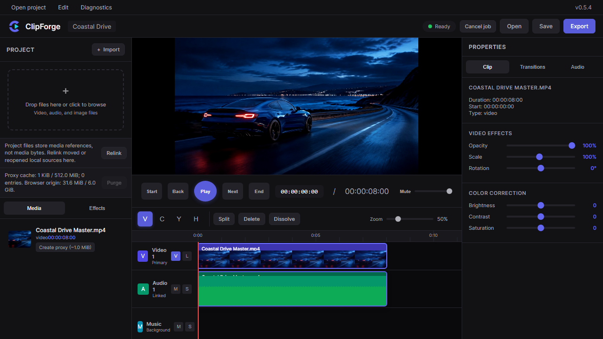
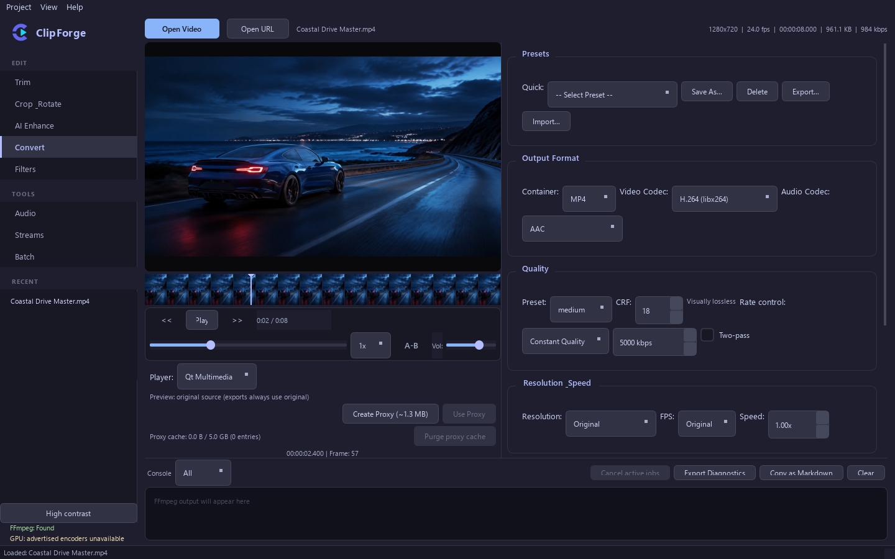

# ClipForge v0.5.4


[](https://github.com/SysAdminDoc/ClipForge/releases/latest)
[](LICENSE)


[](https://sysadmindoc.github.io/ClipForge/)

ClipForge is a private video editor with two ways to work. Open the browser
timeline for a quick cut with no upload. Use the desktop app when you need
format control, local AI tools, stream inspection, or a durable batch queue.
Your media stays on your machine in both.

- [Open the browser editor](https://sysadmindoc.github.io/ClipForge/)
- [Download the latest desktop release](https://github.com/SysAdminDoc/ClipForge/releases/latest)
- [Build it from source](#build-from-source)

## See it in action

### Browser timeline



Import video, audio, or images and arrange them on a three-track timeline.
ClipForge shows real thumbnails, linked audio, trim handles, clip properties,
and export readiness in one screen.

### Desktop workstation



The desktop app pairs a full preview with FFmpeg controls for conversion,
filters, audio work, stream handling, and repeatable batch jobs.

## Pick the right workspace

| | Browser editor | Desktop app |
|---|---|---|
| Best for | Fast timeline edits and private browser work | Deeper processing and batch operations |
| Runs on | A modern desktop browser | Windows, Linux, or macOS |
| Media engine | Self-hosted FFmpeg.wasm | Your local FFmpeg and ffprobe |
| Main tools | Split, trim, move, proxy, color, audio, transitions, export | Trim, crop, convert, filter, enhance, inspect, compare, batch |
| Project format | Versioned `.cfproj` with source relinking | Versioned `.cfproj` with relative-path relinking |
| Media privacy | Files remain in the browser session | Files stay on local storage |

## What ClipForge handles

- **Edit:** trim ranges, crop, rotate, flip, split clips, and adjust playback.
- **Finish:** color correction, LUTs, stabilization, subtitles, captions, and redaction.
- **Deliver:** MP4, MKV, WebM, MOV, AVI, GIF, audio exports, presets, and batch queues.
- **Inspect:** media metadata, selective remuxing, snapshots, plus VMAF, PSNR, and SSIM reports.

Hardware encoders are probed before ClipForge advertises them. Optional local
tools add Real-ESRGAN or SPAN upscaling, RIFE interpolation, Whisper captions,
Tesseract hardsub OCR, yt-dlp URL import, and an experimental libmpv preview.

## Why local matters

There is no ClipForge account and no media upload service. The browser runtime
is pinned and served from the same site as the editor. After the first load,
its service worker can restart from cache.

The desktop app stages output before replacing a destination file. Browser
export also checks the timeline before rendering. If the current FFmpeg.wasm
pipeline cannot represent a gap, overlap, transition, detached track, or
effect, ClipForge stops and explains the problem instead of dropping it.

Support exports are bounded and redact local paths, URL credentials, secret
options, and private media metadata by default. Optional update checks contact
GitHub for release metadata only. They never download or install an update.

## Start in the browser

Open **[ClipForge on GitHub Pages](https://sysadmindoc.github.io/ClipForge/)**.
The first visit loads the pinned FFmpeg core, which is about 31 MB. Later
starts can use the local cache.

Browser projects reference your source files rather than copying media into
the project file. Reopen a project, relink moved files, and continue editing.

## Install the desktop app

Download the current build from
**[GitHub Releases](https://github.com/SysAdminDoc/ClipForge/releases/latest)**.
Install [FFmpeg](https://ffmpeg.org/download.html), then make sure both
`ffmpeg` and `ffprobe` are available on `PATH`.

The current Windows executable is unsigned because the project does not yet
have a code-signing certificate. Check it against `SHA256SUMS.txt` from the
same release before running it.

The base desktop app needs Python 3.11 or newer and PyQt6 6.11 when run from
source. The optional tools listed above are not installed automatically.

## Build from source

Windows PowerShell:

```powershell
git clone https://github.com/SysAdminDoc/ClipForge.git
cd ClipForge
py -3.12 -m venv .venv
.\.venv\Scripts\python -m pip install --require-hashes -r requirements-dev.lock
.\.venv\Scripts\python -m playwright install chromium
.\.venv\Scripts\python scripts\release_check.py --build
```

Linux or macOS:

```bash
git clone https://github.com/SysAdminDoc/ClipForge.git
cd ClipForge
python3 -m venv .venv
./.venv/bin/python -m pip install --require-hashes -r requirements-dev.lock
./.venv/bin/python -m playwright install chromium
./.venv/bin/python scripts/release_check.py --build
```

The release gate generates real media fixtures, exercises edit and conversion
paths, runs the Python and browser suites, opens the GUI offscreen, and tests
the packaged application. A successful build writes the executable, a provenance
manifest, and `SHA256SUMS.txt` to `dist/`.

To refresh the two README screenshots after a UI change:

```powershell
py -3.12 scripts\capture_marketing.py
```

The capture runs the browser headlessly and renders the desktop app with Qt's
offscreen platform. It does not take over the active display.

## Development checks

```powershell
py -3.12 scripts\sync_version.py --check
py -3.12 scripts\verify_browser_runtime.py
py -3.12 -m pytest -q
py -3.12 -m compileall -q clipforge scripts tests
node --check editor.js
node --check bootstrap.js
node --check coi-serviceworker.js
```

Version metadata starts in `clipforge/version.py`. Use
`py -3.12 scripts\sync_version.py --set X.Y.Z` to update the desktop app,
browser editor, README badge, and Windows executable metadata together.

## License

ClipForge is available under the [MIT License](LICENSE).
